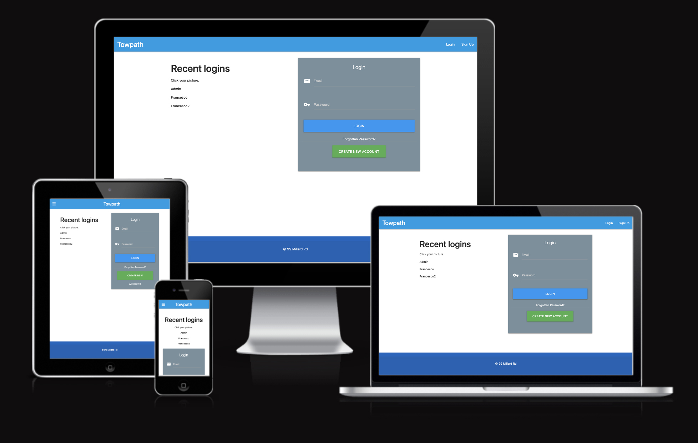

<h1 align="center">Towpath Marketplace</h1>

[View the live project here.](https://flask-app-marketplace.herokuapp.com/login) 

 ### Rationale for the development of the project

Towpath marketplace is a platform for individuals to sell goods/services in a hyperlocal geographical area. Seller segments are individuals, and small businesses.

<h2 align="center"></h2>

-   ### Design
    -   #### Colour Scheme
        -   The main colours used are white and blue provided by materialized. Those colors provide a more elegant look to the website.
    -   #### Typography
        -    I used the default bootstrap font-family Roboto. The font is used throughout the whole website with Sans Serif as the fallback font in case for any reason the font isn't being imported into the site correctly. I think this font is a clean and it is used frequently in programming, so it is both attractive and appropriate.
    -   #### Imagery
        -   Imagery is important. I used imgages(free lincence on unsplash) and I used photoshop to make them web-friendly(resizing).


## Goals and Target audience

### Project goals

- The web app will provide a platform where anyone can buy and sell items.

### User Goals

- Find information about what Towpath is all about.
- Find information about how to use Towpath.
- Easily register and buy or sell items.
- View their items.

### Site owners goals

- Marketplace allows users to trade within their neighborhood by enabling people to post and browse goods within a certain zip code. 
- Towpath mission: To provide the tools for people to come together and build community 

## Target audience

- The application will be able to be usable by all ages.
Those looking for an application to sell and buy items

## User experiance (UX)

- During project planning, it was set out that the user interface should be easily understood to provide an overall good user experience and provide a positive feeling when navigating and interacting with the application.
As the application is aimed at all ages, logical placement of buttons and understandable form fields will all be clearly tagged to ensure no barriers are present or experienced whilst using the application.


### User stories

## First time user

- As a first-time user, I want to understand what the applications purpose is so that I can decide if it meets my needs. [view](marketplace/static/img/user_xd_towpath/filter_by_category.png)
- As a first-time user, I want to be able to easily navigate to the registration page.
- As a first-time user, I want to find out how to add an item to the dashboard.
- As a first-time user, I want to view my items.
- As a first-time user, I want to find out more information about an item I have added.
- As a first-time user, I want to find out how to remove an item in case I make a mistake.
- As a first-time user, I want to know how to log out of Towpath.

## Returning user
-  As a returning user, I want to be able to easily navigate to the login page.
- As a returning user, I want to be able to edit an item entry I have in my collection.
- As a returning user, I want to be able to see how many items are in my collection. [view](marketplace/static/img/user_xd_towpath/filter_by_category.png)

## Site owner
- As the site owner, I want visitors to find Towpath approachable and know its purpose from the outset.
- As the site owner, I want visitors to be able to easily add their or buy someoneelse items.
- As a site owner, I want to encourage give a second lfe to items unwanted.


*   ### Wireframes

    -   Wireframe - [Laptop](marketplace/static/img/wireframes/laptop_towpath.jpg)
    -   Wireframe - [Tablet](marketplace/static/img/wireframes/tablet_towpath.jpg)
    -   Wireframe - [Smartphone](marketplace/static/img/wireframes/smarthphone_towpath.jpg)


## Features

-   Responsive on all device sizes

-   Interactive elements

### Languages Used

-   [HTML5](https://en.wikipedia.org/wiki/HTML5)
-   [CSS3](https://en.wikipedia.org/wiki/Cascading_Style_Sheets)
-   [JAVASCRIPT](https://en.wikipedia.org/wiki/JavaScript)
-   [PYTHON](https://en.wikipedia.org/wiki/Python_(programming_language)


### Frameworks, Libraries & Programs Used

1. [Materialize:](https://materializecss.com/)
    - Materialize was used to assist with the responsiveness and styling of the website.
1. [Google Fonts:](https://fonts.google.com/)
    - Google fonts were used to import the 'Titillium Web' font into the style.css file which is used on all pages throughout the project.
1. [Font Awesome:](https://fontawesome.com/)
    - Font Awesome was used on all pages throughout the website to add icons for aesthetic and UX purposes.
1. [jQuery:](https://jquery.com/)
    - jQuery came with Bootstrap to make the navbar responsive but was also used for the smooth scroll function in JavaScript.
1. [Git](https://git-scm.com/)
    - Git was used for version control by utilizing the Gitpod terminal to commit to Git and Push to GitHub.
1. [GitHub:](https://github.com/Babalu2017/ElectricSkateboardClub)
    - GitHub is used to store the projects code after being pushed from Git.
1. [Adobe Xd:](https://www.adobe.com/uk/products/xd.html)
    - xd was used to create the wireframes during the design process.
1. [Adobe Photoshop:](https://www.adobe.com/uk/products/photoshop.html)
    - Photoshop was used to edit photos as well as to make them more web friendly (resizing_save for web legacy option).
1. [Folium Maps:](https://python-visualization.github.io/folium/quickstart.html)
    - folium map  was used in every single item listed.
1. [Flask:](https://flask.palletsprojects.com/en/2.2.x/)
    - This micro framework has been used to build tha web app.
1. [Postgresql:](https://www.postgresql.org/)
    - Postgresql has been used to create the database where all the data are stored.
1. [AWS_S3:](https://aws.amazon.com/s3/?nc1=h_ls)
    - Amazon Simple Storage Service (Amazon S3) is used to store all the images.

## Testing

The W3C Markup Validator, W3C CSS Validator and JSHINT Validator Services were used to validate every page of the project to ensure there were no syntax errors in the project.

1.  HTML Sign_up in validator [view](marketplace/static/img/validator/sign_up_w3_validator.png)
2.  HTML dashboard validator [view](marketplace/static/img/validator/dashboard_w3_validator.png)
3.  HTML edit_item validator [view](marketplace/static/img/validator/edit_item_w3_validator.png)
4.  HTML home validator [view](marketplace/static/img/validator/home_w3_validator.png)
5.  HTML inbox validator [view](marketplace/static/img/validator/inbox_w3_validator.png)
6.  HTML new_message validator [view](marketplace/static/img/validator/new_message_w3_validator.png)
7.  CSS  Style_Sheet validator [view](marketplace/static/img/validator/style_css_validator.png)
8.  JS  Script.js [view](marketplace/static/img/validator/jhint_validator_1.png)
## Lighthouse Testing
1. dashboard [view](marketplace/static/img/lighthouse_testing/dashboard_lighthouse_testing.png)
2. home [view](marketplace/static/img/lighthouse_testing/home_lighthouse-tetin.png)
3. inbox [view](marketplace/static/img/lighthouse_testing/inbox_lighhouse_testing.png)
4. login [view](marketplace/static/img/lighthouse_testing/login_lighthouse_testin.png)
5. signup [view](marketplace/static/img/lighthouse_testing/sign_up_lighthouse_testing.png)


###  Testing

1.   The Website was tested on different browsers such as: Chrome, Edge, Safari 
    
2.   The website was viewed on a variety of devices such as: Laptop, iPhoneXR, iPhone12, Samsung_Galaxy_Fold, iPad_Air, Samsung_Galaxy_a51/71

3.   A large amount of testing was done to ensure that all pages were linking correctly [view](marketplace/static/img/validator/manual_testing_towpath.jpg).

4.   Friends and family members were asked to review the site and documentation to point out any bugs and/or user experience issues.

### Known Bugs/Errors

-   The app crash if users insert a wrong postcode when they list an item. Error: [list out of range]. The bug was fixed adding if statements and flash messages. [view](marketplace/static/img/user_xd_towpath/fix_bug_wrong_postcode.png)


## Deployment

### Deploying a Project to Heroku

The project was deployed to Heroku using the following steps...

1. Pip3 list to list dependences for the application in the terminal
2. Pip3 freeze –-local > requirements.txt //generates a requirements.txt file for Heroku
    - If any new packages are added, this file must be updated and added to Heroku.
3. echo web: python run.py &gt; Procfile generates a Proc file for Heroku
    - Note: Using echo may cause the Proc file to add an extra line at end of the file, delete the extra line to avoid problems.
4. Push to GitHub
5. The page will automatically refresh.

### Go to Heroku and login
 - Note: Heroku allows 5 apps without verifying adding details and 100 if details are added

1. Navigate to the dashboard once logged in and at the top right select "New" then create new app
2. Give your app a unique name in the text field
3. Select your region "Europe" and select Create app

- Will be redirected to the deploy screen.
- Do not upload our local database, create a new one in Heroku instead to avoid personal data breaches, covered further on.

1. Select the Resources tab then under add-ons search for Heroku Postgres and when found select.
2. A Popup will ask for the account type, select hobby dev – free and then Submit order

- Heroku will then attach postgresql to the app.

1. The add-on heroku-postgresql has been installed will be displayed when done.
2. Click settings and go to config vars and then select reveal config vars
3. Enter into the fields the details from the env.py file

- Important: do not add Development or DB_URL keys and values 
- Key and Value eg. IP (Key) 0.0.0.0 (Value)


1. Once a key and value have been entered, select add to generate another field to enter another key and value.
2. SECRET_KEY – the value field of this key can be anything you choose
3. Set debug to True when building, but must set to False when submitting a project for assessment.

### Go back to your IDE
 - At the moment, the app.config lines are pointing to the SECRET_KEY and DB_URL
 - Because Heroku is using a different Database, we need to add a conditional statement to check if we are accessing a local DB or the one on Heroku.

1. pen the __init__.py file
- Example app.config call:
- app.config["SQLALCHEMY_DATABASE_URI"] = os.environ.get("DB_URL")

2. Add a conditional statement:
- if os.environ.get("DEVELOPMENT") == "True":
- app.config["SQLALCHEMY_DATABASE_URI"] = os.environ.get("DB_URL") # This is the local DB
- else:
- app.config["SQLALCHEMY_DATABASE_URI"] = os.environ.get("DATABASE_URL") # This is the Heroku DB

3. Save the file and push changes to the GitHub repo

4. Then go back to Heroku


### Heroku dashboard

1. Select the Deploy tab on to left top menu:
- There are 3 options to choose, Heroku CLI, GitHub or Container registry
- Select GitHub (connect to GitHub) Will use the repo to build the app and update changes.
- Just below, next to connect to GitHub there will be a search for a repository to connect to field.
- Make sure it is your name and then enter the repo name in the search field and select search.
- The repo should show bellow and if all looks good, select the Connect button.
- Just below next to Automatic deploys make sure main branch is in the dropdown field. Then select Enable Automatic Deploys button.

- Note: Please be aware: Do not push to GitHub from your machine if the app you are working on does not load or has errors e.g. Jinja errors, as if you do the Heroku app will not be able to build and will cause errors in the Heroku dashboard.

2. Finally select the Deploy Branch button at the bottom of the page.
- This may take a few minutes while it builds, when it is done, there will be a message saying:
- Your app was successfully deployed with a view button. (Do not click)

3. Go to Settings top left, and then select reveal config vars as we did before, you should see that data has been auto populated.
- The area to take note of is the DATABASE_URL value field: 
- If it says postgres:// Then further steps are needed
- If it says postgresql:// - Ignore the below steps.

### Steps:

1. Open the __INIT__.py file in your IDE.
- And add the following code:
- Import re (at the top of the file just below import os)
Within the else statement that was added in previous steps, amend the code to as follows: We are adding a uri variable which will string replace one url for another.
- if os.environ.get("DEVELOPMENT") == "True":
app.config["SQLALCHEMY_DATABASE_URI"] = os.environ.get("DB_URL")
else:
uri = os.environ.get("DATABASE_URL")
if uri.startswith("postgres://"):
uri = uri.replace("postgres://", "postgresql://", 1)

app.config["SQLALCHEMY_DATABASE_URI"] = uri # Heroku

2. Save and push to GitHub
- Wait a few minutes to allow Heroku to rebuild the app

### Go back to Heroku
1. Select the Activity tab, top left of the screen, then select the more button at the top right and choose Run console
2. Console will open.
3. Enter: python3 in the field, select run or hit enter
4. Then in the console window enter:
- from "main folder" import db THEN  Press enter

Note: ( is the name of the database in this case but will be whatever your db is called)

5. Then enter:
- db.create_all() Press enter

- When a new line shows &gt;&gt;&gt;&gt;&gt;

6. enter: exit() Press enter and then use the "X" to the right to close the console window.
7. With everything setup: Select the Open app button at the top right of the screen and your app should be displayed in all its glory.

- Note: the database is empty, so new data will need to be entered etc.


### Forking the GitHub Repository

By forking the GitHub Repository we make a copy of the original repository on our GitHub account to view and/or make changes without affecting the original repository by using the following steps...

1. Log in to GitHub and locate the 
2. At the top of the Repository (not top of page) just above the "Settings" Button on the menu, locate the "Fork" Button.
3. You should now have a copy of the original repository in your GitHub account.

### Making a Local Clone

1. Log in to GitHub and locate the GitHub Repository click "Clone or download".
3. To clone the repository using HTTPS, under "Clone with HTTPS", copy the link.
4. Open Git Bash
5. Change the current working directory to the location where you want the cloned directory to be made.
6. Type `git clone`, and then paste the URL you copied in Step 3.

```
$ git clone https://github.com/YOUR-USERNAME/YOUR-REPOSITORY
```

7. Press Enter. Your local clone will be created.

```
$ git clone https://github.com/YOUR-USERNAME/YOUR-REPOSITORY
> Cloning into `CI-Clone`...
> remote: Counting objects: 10, done.
> remote: Compressing objects: 100% (8/8), done.
> remove: Total 10 (delta 1), reused 10 (delta 1)
> Unpacking objects: 100% (10/10), done.
```

Click [Here](https://help.github.com/en/github/creating-cloning-and-archiving-repositories/cloning-a-repository#cloning-a-repository-to-github-desktop) to retrieve pictures for some of the buttons and more detailed explanations of the above process.

## Credits

### Code

- stack overflow count() method used across the site to tally movies and media types.
- stack overflow for general coding queries.
- YouTube Tutorial (error handling) was used to understand error handling.


### Content

-   All content was written by the developer.

-   Psychological properties of colours text in the README.md was found [here](http://www.colour-affects.co.uk/psychological-properties-of-colours)

### Media

-   All Images were downloaded from [Unsplash](https://unsplash.com).

### Acknowledgements

-   Tutor support at Code Institute for their support and my collegues at Harlow College.